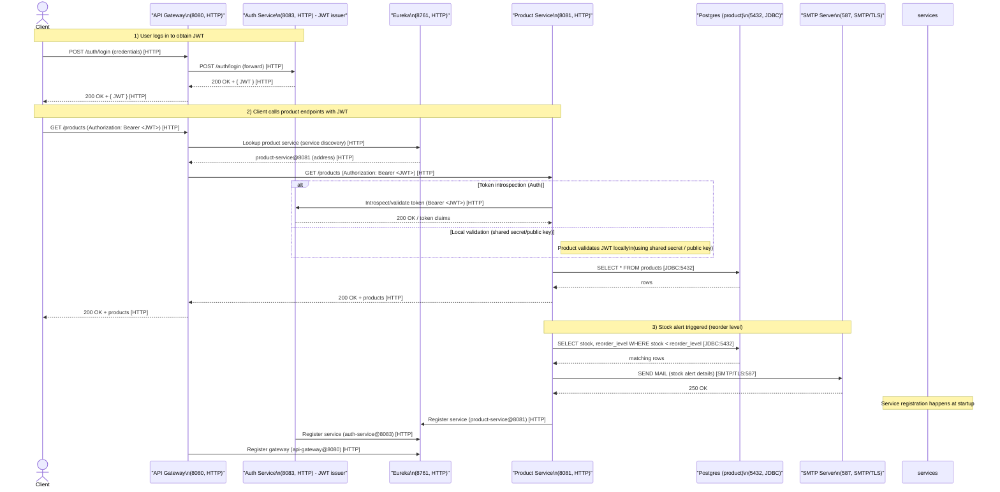

# Inventory Management System — UML Sequence Diagram

```mermaid
sequenceDiagram
    actor Client
    participant APIGateway as "API Gateway\n(8080, HTTP)"
    participant Auth as "Auth Service\n(8083, HTTP) - JWT issuer"
    participant Eureka as "Eureka\n(8761, HTTP)"
    participant Product as "Product Service\n(8081, HTTP)"
    participant ProductDB as "Postgres (product)\n(5432, JDBC)"
    participant SMTP as "SMTP Server\n(587, SMTP/TLS)"

    Note over Client,Auth: 1) User logs in to obtain JWT
    Client->>APIGateway: POST /auth/login (credentials) [HTTP]
    APIGateway->>Auth: POST /auth/login (forward) [HTTP]
    Auth-->>APIGateway: 200 OK + { JWT } [HTTP]
    APIGateway-->>Client: 200 OK + { JWT } [HTTP]

    Note over Client,Product: 2) Client calls product endpoints with JWT
    Client->>APIGateway: GET /products (Authorization: Bearer <JWT>) [HTTP]
    APIGateway->>Eureka: Lookup product service (service discovery) [HTTP]
    Eureka-->>APIGateway: product-service@8081 (address) [HTTP]
    APIGateway->>Product: GET /products (Authorization: Bearer <JWT>) [HTTP]

    alt Token introspection (Auth) 
        Product->>Auth: Introspect/validate token (Bearer <JWT>) [HTTP]
        Auth-->>Product: 200 OK / token claims
    else Local validation (shared secret/public key)
        Note right of Product: Product validates JWT locally\n(using shared secret / public key)
    end

    Product->>ProductDB: SELECT * FROM products [JDBC:5432]
    ProductDB-->>Product: rows
    Product-->>APIGateway: 200 OK + products [HTTP]
    APIGateway-->>Client: 200 OK + products [HTTP]

    Note over Product,SMTP: 3) Stock alert triggered (reorder level)
    Product->>ProductDB: SELECT stock, reorder_level WHERE stock < reorder_level [JDBC:5432]
    ProductDB-->>Product: matching rows
    Product->>SMTP: SEND MAIL (stock alert details) [SMTP/TLS:587]
    SMTP-->>Product: 250 OK

    Note over services: Service registration happens at startup
    Product->>Eureka: Register service (product-service@8081) [HTTP]
    Auth->>Eureka: Register service (auth-service@8083) [HTTP]
    APIGateway->>Eureka: Register gateway (api-gateway@8080) [HTTP]
```
